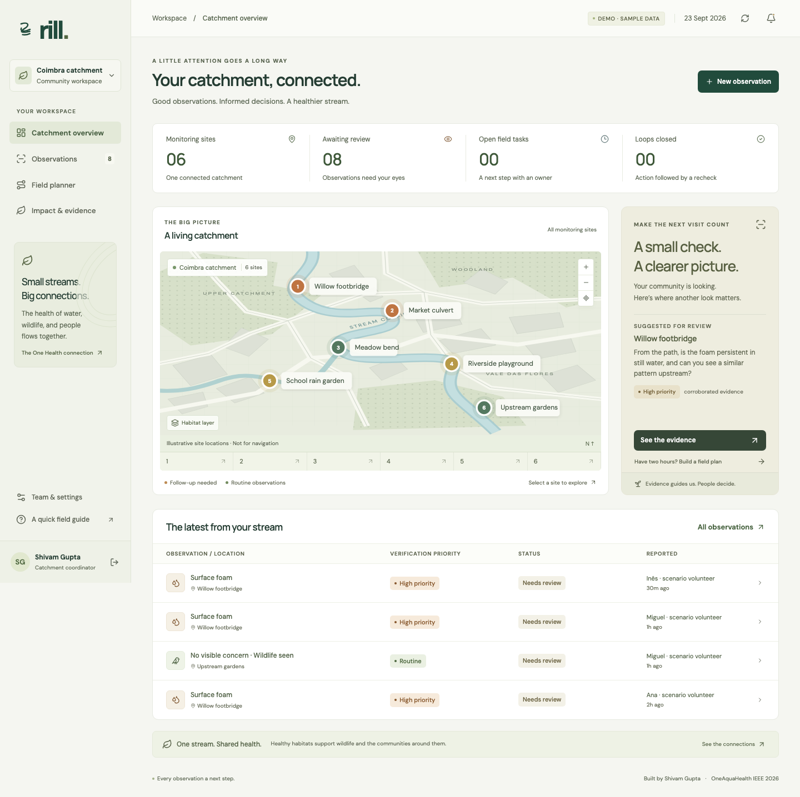
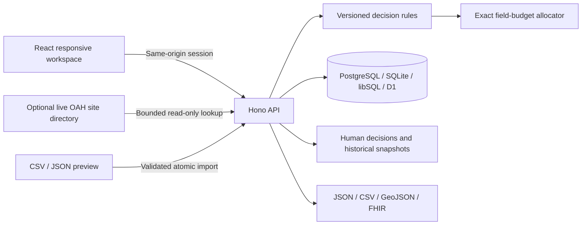

<p align="center"></p>
<h1 align="center">Rill</h1>
<p align="center"><strong>Every observation a next step.</strong><br/>An urban stream fieldwork workspace by Shivam Gupta.</p>
<p align="center">OneAquaHealth IEEE Global Hackathon 2026 · Track 2: Data-to-Insight</p>



A volunteer notices foam below a footbridge. Two others report it too. A coordinator has two hours to check several sites. **Which visits deserve that time, what evidence supports the choice, and who follows through?**

Rill connects that report to a human decision, a budgeted verification plan, an assigned task, and a documented recheck. Visual appearance never becomes a diagnosis of pollution or a statement that water is safe.

[Watch the narrated demonstration](https://www.youtube.com/watch?v=Ezww6CqwqWA) · [Submitted Devpost project](https://devpost.com/software/rill-h8t3s5) · [Submission package](output/README.md) · [Quality checks](https://github.com/shi1720/OneAquaHealth/actions/workflows/ci.yml)

**Try the hosted app:** https://rill-streams.web.app. Firebase Hosting serves the interface, with a Cloud Run API and PostgreSQL on Cloud SQL. The hosted API lifecycle has been verified; see [deployment details](docs/deployment-firebase.md) for operational limits.

## Run it in two minutes

Requires Node.js **22.16 or newer** and npm. No paid API, inference service, email service, or model key is required.

```sh
npm ci
npm run dev
```

Open **http://localhost:5173** and choose **Explore the live demo**. Every demonstration creates its own isolated workspace with six fictional Coimbra-area sites and eight synthetic observations. No shared demo password or configuration is needed. Demo workspaces expire after 48 hours.

Choose **Create a workspace** for real use. New workspaces start empty: add your own sites or review a location from the optional live OneAquaHealth site directory. Registration uses a passphrase with at least 12 characters and shows an offline recovery key once. Save it before entering the workspace. **Forgot your passphrase?** accepts your email and saved key, replaces the passphrase, revokes earlier sessions, and issues a replacement key. Existing accounts can generate a key in **Team & settings** after confirming their current passphrase. No email service is needed; losing both the passphrase and key leaves no email recovery path.

For a single local server:

```sh
npm run build
npm start
# http://localhost:8787
```

The database defaults to `data/rill.sqlite`. The API and frontend share one origin. `npm run dev` explicitly allows the localhost development origin; use the documented URL rather than a LAN IP.

## A complete, testable workflow

1. **Observe.** A guided mobile form records location, time, visible signals, uncertainty, field notes, and an optional photo. It resizes photos and removes metadata. A draft survives dialog closure on that device for 24 hours. Submission retry keys prevent duplicate reports.
2. **Review.** The evidence panel separates an operational priority score from the strength of supporting accounts. Every factor and uncertainty is visible. Serious signs receive a persistent authority-referral banner.
3. **Plan.** An exact budget allocator selects at most one verification visit per eligible site. Change the time available and inspect both the selected and deferred work. Unsafe/restricted sites and already assigned work are excluded.
4. **Act.** A coordinator records a reason, assigns an accountable workspace member, and sets a date. Volunteers can update only their own tasks. Sampling and cleanup coordination stay with coordinators who arrange appropriate expertise.
5. **Recheck.** A meaningful follow-up result, recorded after action begins, is required before resolution. Administrative rechecks can record qualified advice without implying a volunteer entered a hazardous site.
6. **Carry the evidence forward.** Export JSON, CSV, GeoJSON, or an experimental FHIR R4 collection. Decision snapshots preserve the rule version and factors at the time of review. An import preview validates bounded CSV/JSON batches before committing them.

The time budget is a sum of coordinator-supplied site access estimates plus observation time. It is **not a geographic route optimiser**. The score is a published heuristic, **not a calibrated hazard probability or trained AI model**. Matching accounts do not prove independent identities.

## What makes the project distinct

OneAquaHealth already offers a citizen app, dashboards, a resilience map, and a decision-support system. Existing products such as Cartographer also support collection and quality assurance. Rill's proposed niche is the operational handoff: **explained verification choices under a real capacity constraint, followed by accountable action and recheck evidence**.

This is a differentiation hypothesis to test with river teams, not a “world-first” claim. The target buyer is a catchment partnership or river NGO coordinating volunteer reports across several sites. An illustrative €149/month service and pilot success criteria are explained in [the commercial research](docs/research/product-research.md). There are no claimed customers, measured savings, partnerships, or demonstrated environmental outcomes.

## Architecture



- **Frontend:** React 19, TypeScript, Vite, local fonts, original SVG/CSS design, Lucide icons. The demo map is an explicitly illustrative schematic; real workspaces plot their actual site coordinates without inventing a river basemap.
- **Backend:** Hono + Zod, tenant-scoped SQL, atomic writes, database quotas and uniqueness constraints, persistent rate limits, optimistic review revisions, and an attributable audit trail.
- **Storage:** Node's built-in SQLite for a persistent single-node deployment; PostgreSQL on Cloud SQL for the hosted application; optional Turso **libSQL** remote storage and Cloudflare Worker + D1 as additional targets. The same decision engine serves each.
- **Security:** unique salted password hashes, single-use offline recovery keys stored only as hashes, random sessions stored as hashes, HttpOnly/SameSite cookies, Secure production cookies, origin checks, bounded requests, photo access controls, and role enforcement. See [security boundaries](SECURITY.md).

No observations, images, notes, or user data are sent to an external LLM. The optional site-directory lookup sends no observation payloads. Core workflows continue if that upstream is unavailable.

## Verify it

```sh
npm run typecheck
npm test
npm run build
npx playwright install chromium
npm run test:e2e       # builds and starts its own isolated server
npm audit
```

Backend tests cover auth and atomic recovery/session revocation, tenant/role boundaries, CSRF, quota and race conditions, safe planning, optimal allocation versus exhaustive enumeration, lifecycle chronology, imports, exports, and deletion. Eighteen browser scenarios exercise the report-to-recheck flow, real registration/site setup/login/recovery, administration, imports, mobile drafts, keyboard focus, and accessibility checks. Automated checks are not a substitute for field validation or a full security assessment.

```sh
RILL_SMOKE_ORIGIN=http://localhost:8787 npx tsx server/smoke.ts
RILL_TEST_STORAGE=libsql npm test
```

The smoke script creates and deletes disposable test workspaces. A [reproducible engine benchmark](docs/qa/engine-performance.md) compares unchanged outputs at the documented 2,000-report limit; it is a local computation measurement, not a cloud throughput claim. Read [the final verification record](docs/qa/verification.md) for the actual checks run and their scope.

## Deploy

See [the hosted deployment](docs/deployment-firebase.md) for Firebase Hosting, Cloud Run and PostgreSQL, and [alternative deployment instructions](docs/deployment.md) for Docker, a persistent Node host, Render + remote libSQL, and Cloudflare D1. Never use an ephemeral host disk for real workspace data.

```sh
docker build -t rill .
docker run --rm -p 8787:8787 -v rill-data:/app/data \
  -e APP_ORIGIN=http://localhost:8787 -e NODE_ENV=development rill
```

Use HTTPS, `NODE_ENV=production`, the exact public `APP_ORIGIN`, and a tested backup/restore procedure for a real deployment. A free service may have request, storage, or sleep limits. Remote hosting and any outstanding account actions are tracked in the deployment document.

For a verified local SQLite snapshot, run `npm run backup -- backups/rill-2026-09-23.sqlite`. The command includes committed WAL data, checks the snapshot, and refuses to overwrite an existing file. Protect backups as private account data and rehearse your host’s restore procedure.

## Submission package

- [Devpost-ready project description](docs/submission.md)
- [Word-for-word video narration and shot list](docs/demo-script.md)
- [Answers for the judging conversation](docs/judge-questions.md)
- [Research, competitors, and commercial assumptions](docs/research/product-research.md)
- [Decision methodology](docs/methodology.md)
- [Architecture and API](docs/API-CONTRACT.md)
- [Data practices](docs/privacy.md)
- [Independent review and resulting changes](docs/review-independent.md)
- [Deliverable index](output/README.md)

**Track alignment:** primary Track 2 (Data-to-Insight), with relevant elements of Tracks 3 (responsible supported assessment), 6 (resilience workflows), and 7 (experimental interoperability). No claim of trained AI or predictive outbreak detection.

**Submitted on 23 September 2026.** Devpost displayed “Project submitted!” for [Rill](https://devpost.com/software/rill-h8t3s5). The public [YouTube demonstration](https://www.youtube.com/watch?v=Ezww6CqwqWA) is embedded in the project. See the [publication receipt](docs/qa/publication.md) for the observed checks and scope. The displayed deadline is 1 October 2026, 09:30 IST (30 September, 21:00 PDT); the submission acknowledgment does not establish an independent eligibility ruling or judging outcome.

## Honest scope

This is a working, hardened pilot application, not a clinically validated or independently audited production service. Recovery without a saved key, verified email identity, MFA, full offline synchronisation, external notifications, formal OAH/FHIR profile conformance, laboratory integration, and real-world outcome validation are not claimed. Commercial pricing and impact are hypotheses. [Backend operations](server/README.md) describes exact quotas, account lifecycle, deployment differences, and retention.

## Credits and licence

**Shivam Gupta: project creator and submission owner.** Built with AI-assisted research, implementation, design iteration, and testing. Source code is MIT licensed. Demo locations and observations are synthetic. Rill is independent and is not endorsed by OneAquaHealth, IEEE, or the cited organisations.

See [sources and attribution](docs/sources.md) for documentation, fonts, icons, and the optional site-directory source.
